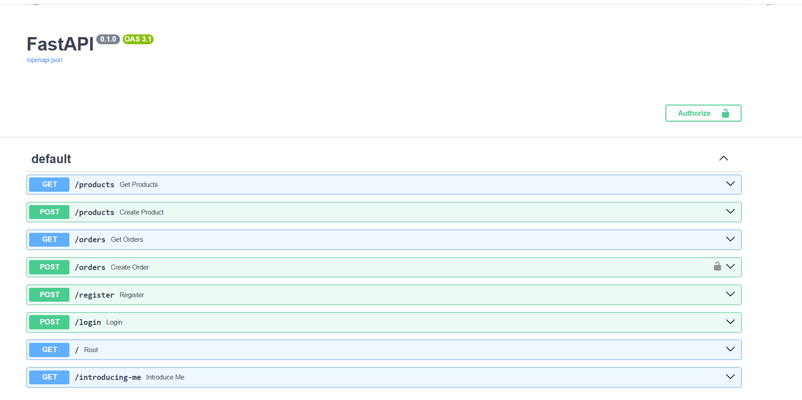
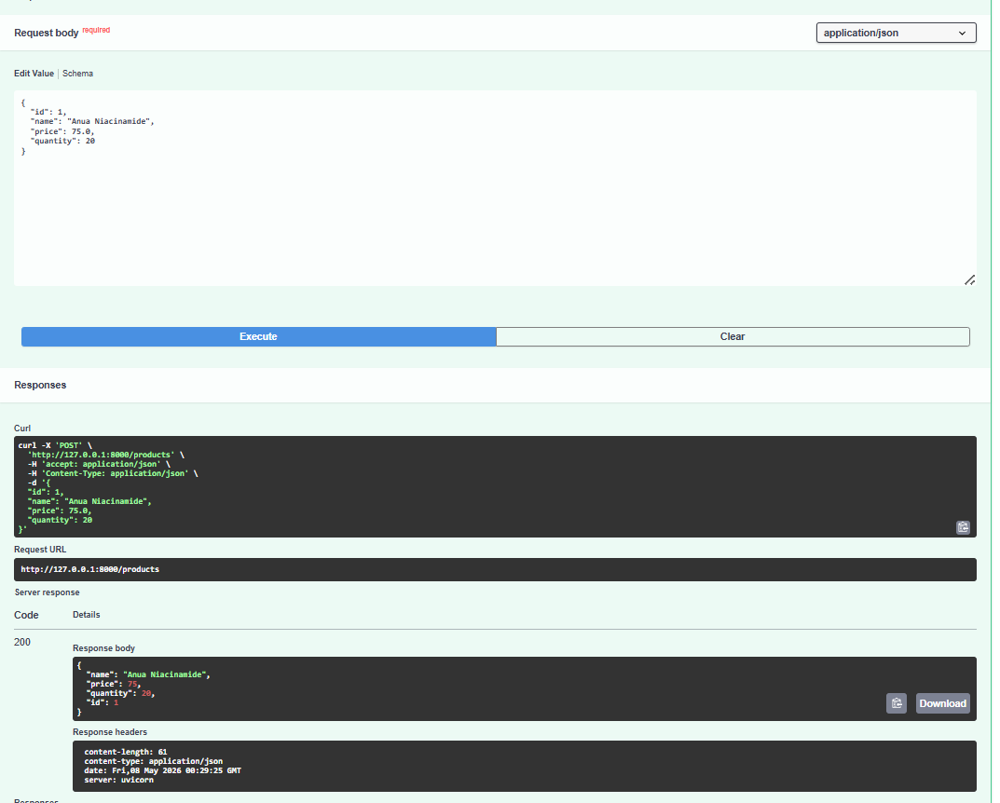
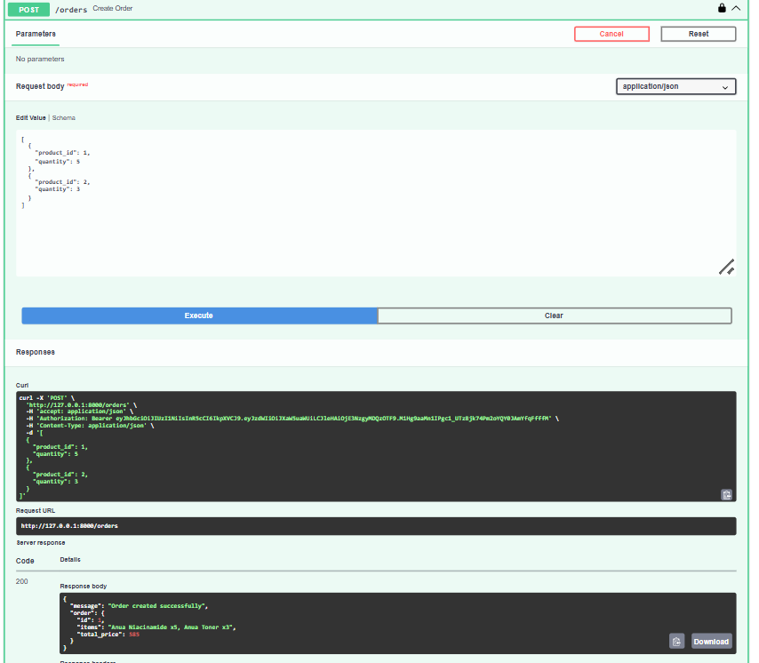
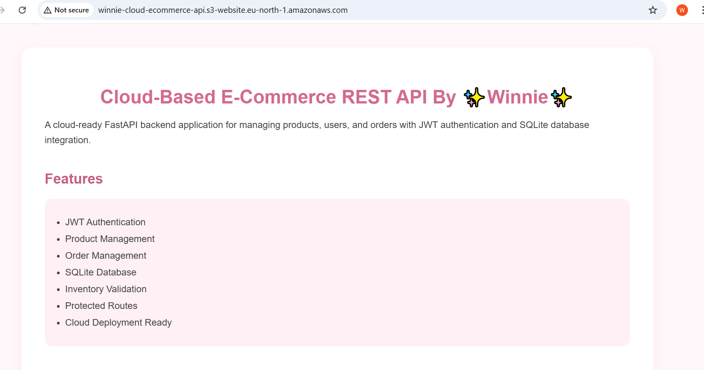

# Cloud-Based E-Commerce REST API

## Project Overview

This project is a cloud-ready e-commerce REST API built using FastAPI. The application allows users to manage products and orders while using JWT authentication for protected routes. The API follows a clean architecture structure and uses SQLite for persistent database storage.

In addition to the backend API, a static project website was created and deployed using AWS S3 Static Website Hosting.

---

## Features

* JWT Authentication
* User Registration and Login
* Product Management
* Order Management
* Inventory Validation
* Protected Routes
* SQLite Database Integration
* Clean Architecture Structure
* Environment Variable Security (.env)
* Static Website Hosting on AWS S3

---

## Technologies Used

### Backend

* Python
* FastAPI
* SQLAlchemy
* SQLite
* Pydantic
* JWT Authentication
* Passlib (bcrypt hashing)

### Cloud & Deployment

* AWS S3 Static Website Hosting
* GitHub

### Frontend

* HTML
* CSS

---

## Project Structure

```plaintext
cloud-ecommerce-api/
│
├── auth/
├── database/
├── models/
├── routers/
├── schemas/
├── services/
├── website/
├── main.py
├── .env
├── .gitignore
└── requirements.txt
```

---

## API Endpoints

| Method | Endpoint  | Description                 |
| ------ | --------- | --------------------------- |
| POST   | /register | Register a new user         |
| POST   | /login    | Login and receive JWT token |
| GET    | /products | Retrieve all products       |
| POST   | /products | Create a new product        |
| GET    | /orders   | Retrieve all orders         |
| POST   | /orders   | Create a new order          |

---

## Authentication

The application uses JWT (JSON Web Tokens) for authentication.

Protected routes require a valid Bearer token.

Example:

```plaintext
Authorization: Bearer your_token_here
```

---

## Inventory Validation

The API validates product stock before creating orders.

Features include:

* Out-of-stock protection
* Quantity validation
* Automatic inventory reduction after purchase

---

## Error Handling

The API uses proper HTTP status codes:

| Status Code | Meaning          |
| ----------- | ---------------- |
| 200         | Success          |
| 201         | Resource Created |
| 400         | Bad Request      |
| 401         | Unauthorized     |
| 404         | Not Found        |
| 409         | Conflict         |

---

## AWS Static Website

AWS Website Link:

http://winnie-cloud-ecommerce-api.s3-website.eu-north-1.amazonaws.com

---

## GitHub Repository

GitHub Repository Link:

https://github.com/Winnie-fg07/shedev-waw-2026-assistant.git

---

## How to Run the Project

### 1. Clone Repository

```bash
git clone https://github.com/Winnie-fg07/cloud-based-E-commerce-API.git
```

### 2. Navigate to Project Folder

```bash
cd cloud-ecommerce-api
```

### 3. Install Dependencies

```bash
pip install -r requirements.txt
```

### 4. Create .env File

```plaintext
SECRET_KEY=your_secret_key
ALGORITHM=HS256
```

### 5. Start Server

```bash
uvicorn main:app --reload
```

---

## API Documentation

FastAPI automatically generates Swagger documentation.

Open:

```plaintext
http://127.0.0.1:8000/docs
```

---

## Screenshots
### Swagger Documentation



### Products Endpoint



### Orders Endpoint



### AWS Hosted Website



---

## Author

Winnie Okechukwu

---

## Conclusion

This project demonstrates backend API development, database integration, authentication, cloud deployment, and clean architecture principles using FastAPI and AWS cloud technologies.
